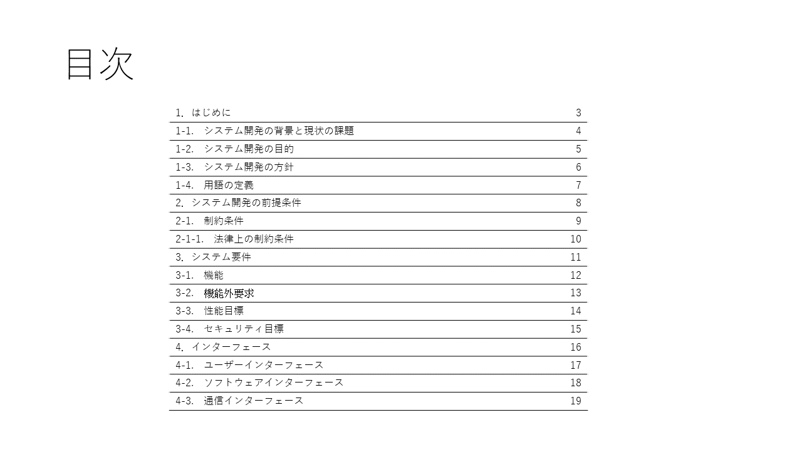

# 概要

このプロジェクトは、PowerPointのドキュメントの目次スライドに自動的に目次を作成するツールです。


## 環境

実行には、PowerPointのインストールが必要

動作確認  
PowerPoint　バージョン2309

ランタイムバージョン  
.Net4.8

## 使い方

1. 目次を作成したいファイルにスライドタイトルが「目次」のスライドを作成する。  
	
	目次スライドを準備する(目次スライド以降のスライドが目次の対象となる)  
	

1. 以下の方法で目次を作成する。

	- コマンドラインパラメータで目次を作成する方法 (コマンドラインから実行を参照)
	- 設定ファイルで目次を作成する方法 (設定ファイルから実行を参照)

1. 目次が作成される。  
	


## 設定項目とデフォルト値

|パラメータ概要|パラメータ例|デフォルト値|
|-|-|-|
|読み込みファイル名 |input.pptx|document.pptx|
|目次スライド名|目次|目次|
|x|目次表示位置x(単位：ポイント)|10|
|y|目次表示位置x(単位：ポイント)|30|
|w|目次表示位置x(単位：ポイント)|500|
|h|目次表示位置x(単位：ポイント)|10|
|保存ファイル名|output.pptx|null|

※保存ファイル名が省略された場合は、読み込みファイル名に上書きされます。

## コマンドラインから実行

```command
PowerPointToc 読み込みファイル名 [目次スライド名] [x] [y] [w] [h] [保存ファイル名]
```

|パラメータ項目|省略|
|-|-|
|読み込みファイル名 |不可|
|目次スライド名|可|
|x|可|
|y|可|
|w|可|
|h|可|
|保存ファイル名|可|

省略時のパラメータの値は、上記項目の「設定項目とデフォルト値」を参照してください


## 設定ファイルから実行

設定ファイル名：PowerPointToc.json

```jsonc
{
	"Input": "input.pptx",
	"TocName": "目次",
	"Output": "output.pptx",
	"X": 5,
	"Y": 10,
	"W": 15,
	"H": 20
}
```

